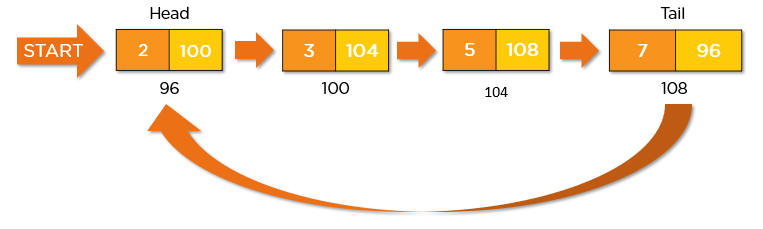
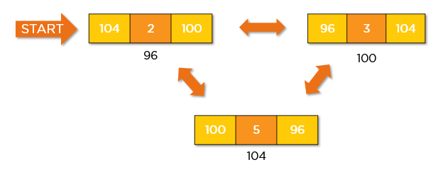

# Linked List

It is an ordered collection of finite,homogenous data elements called nodes where the linear order is maintained by means of links or pointers.

Each node consists of two parts:
- Data Part: where we can store elements
- Pointer part/Link part- Adress that points to the next node in the list
  
## Advantages

1. Dynamic: It can grow or shrink at run time by allocating or deallocating memory so that there is no need for an initial size in the list.
2. No memory wastage for linked list.
3. Implementation is easy for stack and queue.
4. Insertion and deletion operations are easier and efficient.

## Disadvantages 

1. Memory usage is more because pointer field also needs memory to store address
2. Random access is not possible
3. Reverse traversal is not possible
4. Time consuming


## **Representation of Linked List**

```c
struct node
{
    int data;
    struct node *next;
}
```

### **Self Referential structure**

Self Referential structures are those structures that have one or more pointers which point to the same type of structure, as their member.
In other words, structures pointing to the same type of structures are self-referential in nature


In the above example ‘next’ is a pointer to a structure of type ‘node’. Hence, the structure ‘node’ is a self-referential structure with ‘next’ as the referencing pointer. 
An important point to consider is that the pointer should be initialized properly before accessing, as by default it contains garbage value.

## **Types of Linked List**

1. ***Singly Linked List***
   ***

A singly linked list is a unidirectional linked list. So, you can only traverse it in one direction, i.e., from head node to tail node.Reverase traversal is not possible


1. Doubly Linked List
***

A doubly linked list is a bi-directional linked list. So, you can traverse it in both directions. Unlike singly linked lists, its nodes contain one extra pointer called the previous pointer. This pointer points to the previous node.


3. Circular Linked List
***

Unlike a traditional linked list, a circular linked list has no beginning or end – it is essentially a ring of nodes.A circular Linked list is a unidirectional linked list. So, you can traverse it in only one direction



1. Circular Double Linked List
***
  
A circular doubly linked list is a mixture of a doubly linked list and a circular linked list. Like the doubly linked list, it has an extra pointer called the previous pointer, and similar to the circular linked list, its last node points at the head node. This type of linked list is the bi-directional list. So, you can traverse it in both directions.




## **Dynamic Memory Allocation**

**syntax : ptr =(cast type *)malloc(size)***

It is used for allocating a block of memory dynamically and it will return the starting adress of the block

eg:
```c
ptr=(int *)malloc(sizeof(int))
prt1=(struct node*)malloc(sizeof(struct node))
```

## **Linked List Insertion** 

1. ***Insertion at the begginning***


The new node is always added before the head of the given Linked List. And newly added node becomes the new head of the Linked List. For example, if the given Linked List is 10->15->20->25 and we add an item 5 at the front, then the Linked List becomes 5->10->15->20->25.


```c
void insert_beg()
{
    int item;
    printf("Enter the data item");
    scanf("%d",&item);
    x=(struct node*)malloc(sizeof(struct node))
    x->data = item;
    x->next=NULL;
    if(start==NULL)
    start=x;
    else
    {
        x->next=start;
        start=x;
    }
}
```

2. ***Insertion at the end***
   
The new node is always added after the last node of the given Linked List. For example if the given Linked List is 5->10->15->20->25 and we add an item 30 at the end, then the Linked List becomes 5->10->15->20->25->30. 
Since a Linked List is typically represented by the head of it, we have to traverse the list till the end and then change the next to last node to a new node.


```c
void insert_end()
{
    int item;
    printf("enter the data item");
    scanf("%d",&item);
    x=(struct node*)malloc(sizeof(struct node))
    x->data = item;
    x->next=NULL;
    if(start==NULL)
    start=x;
    else
    {
        temp=start;
        while(temp->next!=NULL)
        temp=temp->next;
        temp->next=NULL;
    }
}
```

3. ***Insertion at a particular position***

We are given a pointer to a node, and the new node is inserted after the given node.

Follow the steps to add a node after a given node:

Firstly, check if the given previous node is NULL or not.
Then, allocate a new node and
Assign the data to the new node
And then make the next of new node as the next of previous node. 
Finally, move the next of the previous node as a new node.


```c
void insert_pos()
{
    int item,pos,k;
    printf("Enter the item");
    scanf("%d",&item);
    printf("Enter the position");
    scanf("%d",&pos);
    x=(struct node*)malloc(sizeof(struct node))
    x->data = item;
    x->next=NULL;
    temp=start;
    for(k=1;k<pos-1;k++)
    temp=temp->next;
    x->next=temp->next;
    temp->next=x;
}
```


